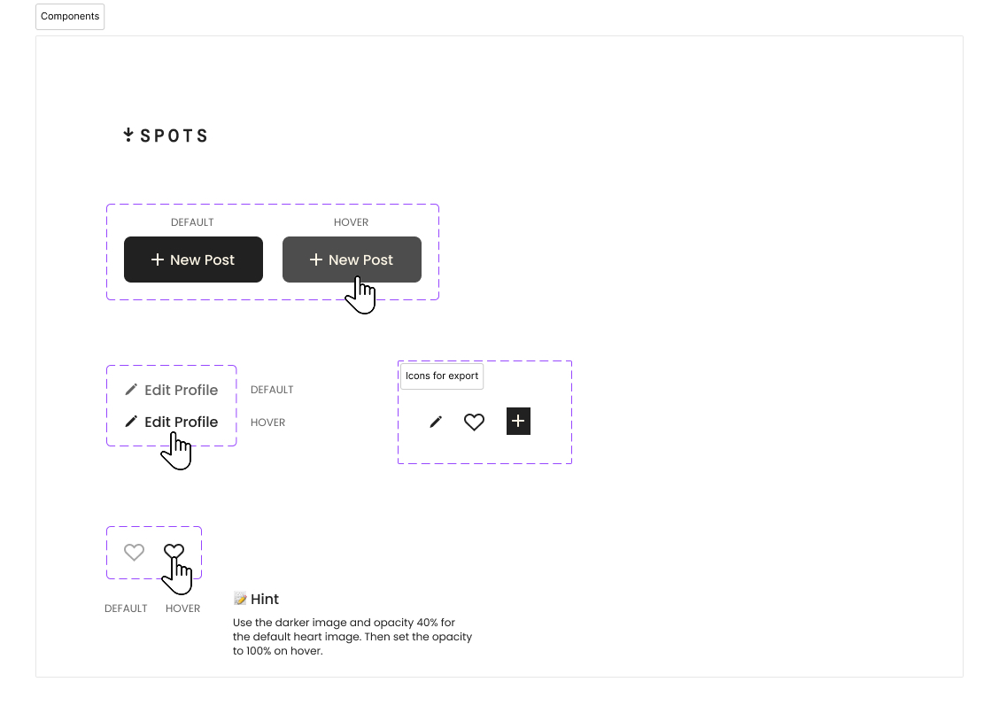

# Project 3: Spots

### Overview  

* Description  
* Figma Link 
* Images from Figma 
* Project Link
* Video Pitch Link Loom
* Video Pitch Link Google Docs

**Description**
  
This project is made so all the elements are displayed correctly on popular screen sizes. Additional techniques include hiding overflow for single and multiple rows of text, as well as hover states.
  
**Figma Link**  
  
* [Link to the project on Figma](https://www.figma.com/file/BBNm2bC3lj8QQMHlnqRsga/Sprint-3-Project-%E2%80%94-Spots?type=design&node-id=2%3A60&mode=design&t=afgNFybdorZO6cQo-1)
  
**Images**  
  
  Components used from Figma and their hover states

Example of hiding overflow for multiple and single rows of text

**Project Link**
* [Link to the project on GitHub](https://roymroldan.github.io/se_project_spots/)

**Video Pitch Link**
* [Link to the project pitch video on loom](https://www.loom.com/share/45c2dcda3eef4b2499cbd1bb1cae6c9a)

## Project Pitch Video Google Docs
 
 Check out [this video](https://drive.google.com/file/d/1XTiObHi8LQxC2UrDn1_rTMEYEr1L5bwR/view?usp=sharing), where I describe my 
 project and some challenges I faced while building it.
